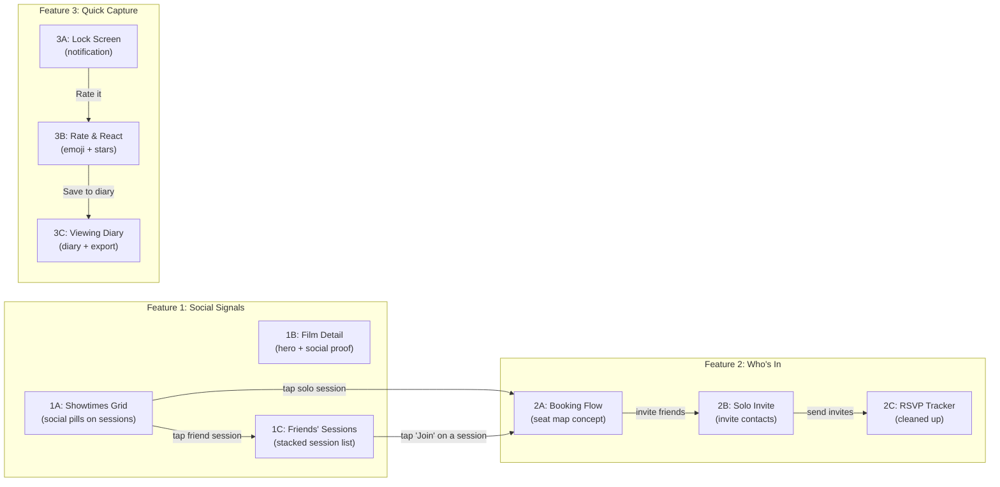

# Gallery Screen Overhaul -- Strategy & Implementation Plan

## Diagnosis

After auditing all 9 screens, the codebase has three structural problems that undermine the case study:

### 1. Identity crisis: 4 screens are the same component

`[ScreenViewerLayout.tsx](ui-concept/src/layouts/ScreenViewerLayout.tsx)` maps screens 1A, 1B, 1C, and 2A to `<FilmDetailScreen />` with only an `initialSheet` prop varying. The user clicks four different cards and sees the same showtimes page, just with a bottom sheet pre-opened for 1C and 2A.

### 2. Dead-end interactions

- "Buy tickets" closes the sheet or shows a checkmark -- no checkout
- "Who else is going?" navigates to 2B, but that screen's purpose is unclear
- The SocialSignalBadge says "3 friends" but tapping only surfaces Sarah & Tom in a generic bottom sheet 
- "+ Invite" on 2C, Share, Filter, and several other buttons are no-ops

---

## Strategy: Each Screen Owns a Unique Moment

The 9 screens map to three **journeys** (Social Signals, Who's In, Quick Capture). Each screen within a journey must show a distinct *moment* that is visually and functionally different at first glance. The proposed restructuring:

---

## Screen-by-Screen Plan

### Screen 1A -- Showtimes + Social Signals (keep, refine)

**File:** `[FilmDetailScreen.tsx](ui-concept/src/screens/app/FilmDetailScreen.tsx)` stays as 1A's backing component.

- **Current:** Works well -- showtimes grid with social pills, date picker, cinema listings.
- **Change:** When "Join" is tapped on the SocialSignalBadge, instead of opening the generic bottom sheet, navigate to the new **Friends' Sessions** screen (1C).
- **Change:** Tapping a session pill where friends ARE attending also navigates to Friends' Sessions screen (filtered to that session).
- **Keep:** Tapping a solo session (no friends) opens the existing bottom sheet, but "Buy tickets" now navigates to 2A's booking flow concept.

### Screen 1B -- Film Detail + Social Context (NEW screen, replaces `FilmDetailScreen`)

**New file:** `screens/app/FilmDetailSocialScreen.tsx`

- **Distinct from 1A:** This is NOT a showtimes page. It is a **film detail page** -- hero-first, with the full synopsis, director card, RT/audience scores, cast, and social proof woven into the detail.
- **Social elements:** A "Friends who want to see this" section showing 3 friend avatars with their status (going / interested / watchlisted). Inline friend reaction quotes if any have rated it.
- **No showtimes grid** visible -- a single "View Showtimes" CTA at the bottom scrolls down or links to 1A conceptually.
- **Visual identity:** Taller hero (backdrop fills ~45% of screen), synopsis visible, RT badge prominent. Immediately reads as "film detail" not "showtimes."

### Screen 1C -- Friends' Sessions Page (NEW screen, replaces join confirmation)

**New file:** `screens/app/FriendsSessionsScreen.tsx`

- **Concept:** A beautifully designed stacked list showing ALL sessions that friends are attending over the next 7 days. Matching the specific friends to their specific session time.
- **Layout:**
  - Nav bar: "< Back" + "Friends' Sessions" title
  - Film context card at top (poster + title + RT score)
  - Stacked session cards, grouped by date. Each card:
    - Date header (e.g. "Wednesday 18 Feb")
    - Session: time, cinema name, format badge, friend avatars with names
    - "Join" pill button per session
  - Empty states for days with no friend sessions
- **Interaction:** Tapping "Join" on a session card shows a brief confirmation state (checkmark + "You're in!"), then conceptually leads to the booking flow.
- **Data:** New `MOCK_FRIEND_SESSIONS` array derived from existing `SESSIONS_BY_DATE` data, filtering sessions where `friendsAttending.length > 0` and grouping by date.

### Screen 2A -- Booking Flow Concept (REDESIGN from dual CTA)

**Refactor:** `[FilmDetailScreen.tsx](ui-concept/src/screens/app/FilmDetailScreen.tsx)` for 2A becomes a new `BookingScreen.tsx`

- **New file:** `screens/app/BookingScreen.tsx`
- **Concept:** A single concept screen showing the seat selection vision:
  - Session summary at top (film poster, time, cinema, format)
  - **Seat map grid** -- a cinema auditorium layout (8-10 rows, ~12 seats per row):
    - Available seats (light gray)
    - Occupied seats (darker)
    - Friend seats highlighted with gold border + initials (Sarah, Tom)
    - "Suggested" seats next to friends pulsing subtly with gold
    - Selected seats in Flicks red
  - Ticket count: "2 tickets" stepper
  - Price summary: "2x Adult -- $38.00"
  - "Confirm Booking" GoldButton (actual gold `#D4A853`)
  - Tapping confirm shows success state with confetti/check
- **The seat map is the hero visual** -- it communicates "sit next to your friends" instantly.

### Screen 2B -- Solo Booking + Invite from Contacts (REPURPOSE)

**Refactor:** `[WhosJoiningScreen.tsx](ui-concept/src/screens/app/WhosJoiningScreen.tsx)` into `InviteFriendsScreen.tsx`

- **New purpose:** When a user books a session where NO friends are going, they land here to invite people.
- **Layout:**
  - Nav bar: "< Back" + "Invite Friends"
  - Session context card (same pattern as current, with the solo session selected)
  - "No friends are going yet" empty state with illustration
  - Search bar: "Search contacts"
  - Contact list with invite toggle (checkbox or "Invite" pill per row)
  - Footer CTA: "Send X Invite(s)" GoldButton
- **Key difference from old 2B:** This is about inviting people to a session they're NOT already attending. The old screen showed friends who were already interested/going -- that concept now lives in 1C.

### Screen 2C -- RSVP Tracker (CLEANUP)

**File:** `[WhosInTrackerScreen.tsx](ui-concept/src/screens/app/WhosInTrackerScreen.tsx)`

- **Remove:** "Share" button from nav bar
- **Remove:** "Export to Letterboxd" footer entirely (keep Letterboxd export for 3C diary only)
- **Add:** Tapping "+ Invite" opens a small bottom sheet with a friend search/select list to invite more people. After inviting, the new friend appears in the RSVP list with "Invited" badge.
- **Add:** Tapping the "Invited" badge pill next to a person shows a contextual tooltip or transitions it to show "Reminder sent" (micro-interaction to demonstrate the living state).

### Screens 3A, 3B, 3C -- Quick Capture (MINOR POLISH)

These work well and are already distinct.

- **3A** (`[NotificationPreview.tsx](ui-concept/src/screens/app/NotificationPreview.tsx)`): Keep. "Rate it" already opens the sheet (3B state). "Later" navigates to gallery. No changes needed.
- **3B** (NotificationPreview with `initialSheet`): Keep. "Save to diary" already navigates to 3C. No changes needed.
- **3C** (`[DiaryScreen.tsx](ui-concept/src/screens/app/DiaryScreen.tsx)`): Keep. Letterboxd export stays here (this is the correct place for it per user feedback).

---

## Cover Card Fixes

### Cover 2A -- Fix alignment and clipping

In `[GalleryPage.tsx](ui-concept/src/screens/gallery/GalleryPage.tsx)`, the `Cover2A` SVG has:

- Bottom circles at `cy="52"` inside a `viewBox="0 0 120 64"` -- the `r="5"` circles extend to y=57, clipping at 64
- The tree paths don't align with circle centers visually
- **Fix:** Increase viewBox height to 68, adjust circle positions so they sit cleanly on the branches, ensure parent has no additional clipping

### Gallery Cover Descriptions

Update card descriptions in the FEATURES registry to match the new screen purposes (e.g., 1C changes from "Join confirmation" to "Friends' sessions list", 2A changes from "Dual CTA" to "Booking with seat selection", 2B changes from "Friend selection" to "Invite friends to join").

---

## Space Awareness & Polish Audit

Every screen needs verification against the 393x852px phone frame:

- **Dynamic island clearance:** Content must start below 48px (12px top + 36px island height). `StatusBar` component handles this, but some screens (like `NotificationPreview`) have custom status bars that need checking.
- **Bottom safe area:** Content should not extend into the bottom 34px (home indicator zone). Screens using `FlicksTabBar` need proper padding. Screens without it need a bottom spacer.
- **Scroll termination:** The last item in scrollable lists should have enough bottom padding that it's not clipped by the phone frame's `overflow: hidden` + 50px border radius.
- **Content density:** `FilmDetailHeader` at 320px + DualTab + DatePicker + SocialSignalBadge already consumes ~500px before any cinema listings. This is tight for 852px. Consider reducing header to 280px or making the hero more compact.

---

## Data Model Additions

In `[mockData.ts](ui-concept/src/data/mockData.ts)`:

- `**MOCK_FRIEND_SESSIONS`**: Derived from `SESSIONS_BY_DATE`, extracting all sessions where friends are attending, grouped by date string. Each entry: `{ date, dateLabel, cinema, session, friends }`.
- `**MOCK_CONTACTS`**: A list of 6-8 contacts (name, initials, phone, avatarColor) for the invite screen (2B). Distinct from `FRIENDS` -- these are people who aren't on the app yet.
- `**MOCK_SEAT_MAP`**: A 2D array representing cinema rows/seats with status (available, occupied, friend, suggested, selected). Friends' positions marked with their initials.

---

## Router Updates

In `[ScreenViewerLayout.tsx](ui-concept/src/layouts/ScreenViewerLayout.tsx)`, update the SCREENS registry:

- `1a` --> `<FilmDetailScreen />` (keep, it's the showtimes screen)
- `1b` --> `<FilmDetailSocialScreen />` (NEW -- film detail with social context)
- `1c` --> `<FriendsSessionsScreen />` (NEW -- stacked friend session list)
- `2a` --> `<BookingScreen />` (NEW -- seat map concept)
- `2b` --> `<InviteFriendsScreen />` (REPURPOSED -- solo invite from contacts)
- `2c` --> `<WhosInTrackerScreen />` (CLEANED UP -- remove share/letterboxd, add invite)
- `3a` --> `<NotificationPreview />` (keep)
- `3b` --> `<NotificationPreview initialSheet />` (keep)
- `3c` --> `<DiaryScreen />` (keep)

