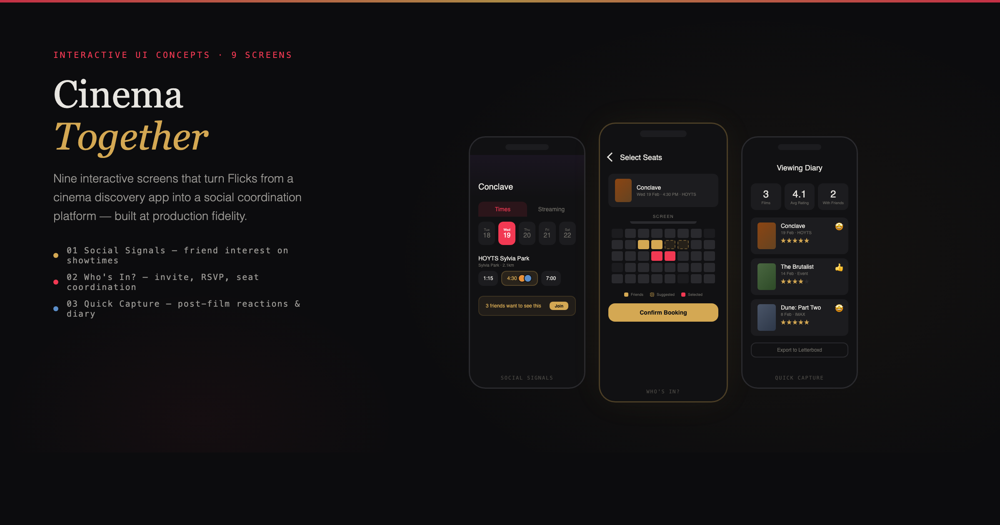

<picture>
  
</picture>

## Flicks — Cinema Together UI Concepts

This repo contains the **interactive UI concepts** for Flicks’ *Cinema Together* initiative: a nine-screen React prototype that turns solitary showtime browsing into a **social, coordinated cinema ritual**.

👉 **Live UI concept gallery:** https://brunohart.github.io/flicks-case-study/

These screens are designed as a **hire-ready artifact** for Vista Group: they demonstrate not just visual depth and motion craft, but also **interaction design, state modelling, and engineering quality** at the level you would ship inside a production app.

> **If you work at Vista / Flicks:** this is the UI layer that sits on top of your existing stack and unlocks new social, data, and commercial value. The strategy case study that motivated these concepts lives in a separate repo; this project is focused on the execution quality of the UI and flows.

---

## What’s in this repo

- **`ui-concept/`**  
  A React 19 + Vite app that renders all nine Cinema Together screens inside an iPhone 15 Pro frame:
  - **Feature 1 — Social Signals**: friend interest on films and sessions
  - **Feature 2 — Who’s In**: invite, RSVP, and coordination flows
  - **Feature 3 — Quick Capture**: post-film reactions and diary

The gallery at the root of the app presents all screens as **animated cover cards** you can click to step into a phone-frame viewer with previous/next navigation.

You can run everything locally (see **Running the prototype** below).

---

## Why this matters for Vista Group

- **Connects discovery to attendance.** Flicks is already strong on “what & where to watch”. These concepts show **how to own the social coordination in the middle** — who is going, when, and with whom.
- **Turns friend intent into measurable revenue.** Social signals and RSVP flows are designed to **multiply ticket yield per intent signal**, not just capture solo bookings.
- **Provides a human, consumer-facing layer on top of Vista’s stack.** The flows are intentionally “thin”: they assume Vista Cloud, Movio and React survey products exist, and they **surface them through a delightful consumer UI**.
- **Demonstrates craft as well as systems thinking.** Every screen is tuned for **gestalt, animation, and micro-interactions**, not just information architecture. This is as much a design-craft artifact as it is a product/system artifact.

For the full strategic narrative, market analysis, and Vista flywheel, see the **separate strategy case study repo** (this repo stays focused on the UI concepts themselves).

---

## Feature overview — Cinema Together

### Feature 1 — Social Signals

Make it obvious when a film is “alive” with friend intent, without turning the app into a social feed.

- **1A — Showtimes with Social Signals**  
  Showtimes page for a single film:
  - Horizontal **date picker** and **cinema listings** with session pills.
  - Session pills highlight where friends are going; avatars appear below times.
  - A **Social Signal banner** surfaces “N friends want to see this” with a Join CTA.
  - Tapping sessions where friends are going takes you to a consolidated **Friends’ Sessions** view.

- **1B — Film Detail with Social Proof** (`FilmDetailSocialScreen`)  
  A hero-first film detail screen that:
  - Uses an expanded **backdrop hero** plus poster + RT/audience scores.
  - Surfaces a **“Friends interested”** section: avatars, statuses (Going / Interested / Watchlisted), and a compact social summary about who wants to see it.
  - Keeps showtimes out of the way (one “View Showtimes” CTA) so this screen reads as **film detail**, not another showtimes grid.

- **1C — Friends’ Sessions** (`FriendsSessionsScreen`)  
  A **stacked, date-grouped list** of every session your friends are attending this week:
  - Each card shows date, time, cinema, format (VMAX / Gold Class), avatars, and names.
  - Gold **Join** pills per session with a subtle joined state (check + “Joined”).
  - Designed to answer: *“Sarah, Tom, and Marcus are going — when and where exactly?”* at a glance.

---

### Feature 2 — Who’s In?

Turn a showtime selection into a lightweight group coordination flow — without turning Flicks into a heavy event planner.

- **2A — Booking / Seat Map Concept** (`BookingScreen`)  
  A single, high-fidelity **seat selection concept**:
  - 8x12 auditorium layout with **friend seats highlighted** (Sarah & Tom), suggested seats pulsing nearby, and selected seats in Flicks red.
  - Ticket count stepper, price summary, and a **Confirm Booking** CTA.
  - On confirm, a success state transitions you toward the RSVP tracker.

- **2B — Invite Friends (from contacts)** (`InviteFriendsScreen`)  
  When you pick a showtime with **no friends going yet**:
  - Session context card at the top clarifies *what* you’re inviting to.
  - Searchable list of **phone contacts** with invite toggles.
  - “Send Invite(s)” CTA with a confirmation state that conceptually flows into the RSVP view.

- **2C — Who’s In? RSVP Tracker** (`WhosInTrackerScreen`)  
  A clean **dashboard for a single session**:
  - Blurred hero with film, time, cinema, and “N confirmed · M awaiting”.
  - Avatar row of confirmed friends plus `+ Invite` pill that opens a bottom sheet.
  - RSVP list with **status badges** (Going, Maybe, Invited, Declined) and a subtle “Reminder sent” micro-interaction when you tap an Invited row.
  - No unnecessary share/export clutter; the focus is on who’s actually in.

---

### Feature 3 — Quick Capture

Capture how screenings felt, not just that they happened — and feed that data back into recommendations and social signals.

- **3A — Lock Screen Notification** (`NotificationPreview`)  
  iOS-style notification shown 2h after a showtime:
  - “How was Conclave?” with poster, static 4/5 star hint, and **Rate it / Later** actions.
  - Tightly matched to iOS affordances (status bar, time, date, home indicator).

- **3B — Emoji-first Reaction + Rating Sheet**  
  Bottom sheet attached to 3A:
  - Emoji-first selection (Loved it, Liked it, It was ok, Boring, Hated it) that auto-sets a star rating.
  - Editable 1–5 star control and optional note field.
  - “Save to diary” CTA that flows directly into 3C.

- **3C — Viewing Diary** (`DiaryScreen`)  
  A **personal viewing log**:
  - Stats row (“3 films · 4.1 avg rating · 2 with friends”).
  - Recent entries as **diary cards**: poster, date, cinema, emoji, star rating, note, and friend stack.
  - A single “Export all to Letterboxd” action lives here (not on the RSVP or booking flows).

---

## Running the prototype

```bash
cd ui-concept
npm install
npm run dev
```

- The app boots at `http://localhost:5173` (or the next available port).
- The **gallery view** is the default: hover the cover cards to see motion, click any card to open the corresponding screen in the phone frame.
- Use the **prev/next arrows** or “All screens” to navigate between concepts.

For a production-like build:

```bash
cd ui-concept
npm run build
npm run preview
```

### Publishing the live gallery (GitHub Pages)

From the repo root:

```bash
cd ui-concept
npm install
npm run deploy
```

That builds the app and pushes the output to the `gh-pages` branch. In the repo **Settings → Pages**, set **Source** to **Deploy from a branch**, branch **gh-pages**, folder **/ (root)**. The site will be at **https://brunohart.github.io/flicks-case-study/**.

The build also emits **404.html** (a copy of **index.html**) so that GitHub Pages serves the SPA for any path (e.g. direct links like `.../app/1a` or a refresh on a concept screen); the app then loads and React Router shows the correct screen.

---

## Architecture & engineering notes

- **Entry point**: `ui-concept/src/App.tsx`  
  Uses React Router to route between a **gallery page** and a **screen viewer layout**.

- **Screen viewer**: `ScreenViewerLayout.tsx`  
  - Renders a 393×852 `PhoneFrame` (iPhone 15 Pro logical size) with a dynamic island.
  - Drives a `SCREENS` registry (IDs `1a–3c`) so cards, routes, and descriptions stay in sync.

- **Feature screens**:  
  - `FilmDetailScreen.tsx` — Showtimes + social signals (1A).
  - `FilmDetailSocialScreen.tsx` — Film detail + social proof (1B).
  - `FriendsSessionsScreen.tsx` — Friend sessions list (1C).
  - `BookingScreen.tsx` — Seat selection concept (2A).
  - `InviteFriendsScreen.tsx` — Contact-based invite flow (2B).
  - `WhosInTrackerScreen.tsx` — RSVP dashboard (2C).
  - `NotificationPreview.tsx` + `DiaryScreen.tsx` — Quick Capture flows (3A–3C).

- **Design system & components**:  
  - `components/layout/PhoneFrame.tsx` — device chrome, dynamic island, shadow.
  - `components/layout/StatusBar.tsx` — iOS-like status bar (light/dark).
  - `components/flicks/*` — extracted Flicks primitives (tabs, date picker, showtime pills, film hero, etc.).
  - `components/cinema-together/*` — new social feature primitives (GoldButton, GoldCheckbox, SocialSignalBadge, FriendRow, RSVPBadge, BottomSheet, ViewingDiaryCard, EmojiReactionPill, etc.).

- **Data**: all mock data is local (`data.ts`, `data/mockData.ts`) — no API calls.

---

## Tech stack (versions)

These are the exact versions used in the `ui-concept` app:

- **React**: `^19.0.0`
- **React DOM**: `^19.0.0`
- **React Router DOM**: `^7.13.1`
- **TypeScript**: `~5.7.0`
- **Vite**: `^6.0.0`
- **Tailwind CSS**: `^4.0.0` (via `@tailwindcss/vite`)
- **Tooling**: `@vitejs/plugin-react`, `@types/react`, `@types/react-dom`

Design system:

- **Flicks brand red**: `#F23953`
- **Cinema Together gold**: `#D4A853`
- **Neutrals**: `#1A1A1E` (primary text), `#F5F5F5` (surface), `#E8E8E8` (borders), `#8E8E93` (secondary text)

---

## Relationship to the strategy case study

This repo is intentionally **UI-only**. It is the interactive front-end that comes out of a much deeper product strategy project:

- Market sizing and cinema attendance trends
- Competitive landscape (Fandango, Atom, Letterboxd, JustWatch, IMDb, current Flicks)
- Vista Group flywheel (Vista Cloud, Movio, React, Horizon)
- Research on what actually drives people to go to the cinema (and with whom)

Those materials — including the long-form **“From Discovery to Ritual”** essay — are housed in a **separate case study repo** so this project can stay focused on the craft and interaction design of the UI.

If you’re evaluating this work for a role or partnership, the recommended reading order is:

1. **Skim this repo** and click through the nine screens to feel the flows.
2. **Read the strategy case study** (separate repo) to see how this execution ties into Vista’s commercial and product strategy.

